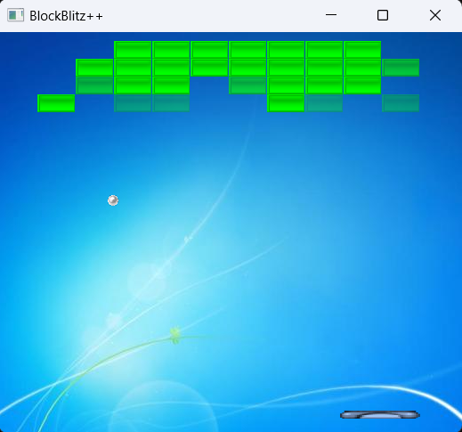

# BlockBlitz++

## Description

This is a simple Breakout game implemented in C++. Breakout is a classic arcade game where the player controls a paddle to bounce a ball and break bricks. The goal is to clear all the bricks on the screen by bouncing the ball off the paddle.

## Features

- Classic Breakout gameplay.
- Paddle control using keyboard input.
- Collision detection for bouncing the ball off the paddle and bricks.
- The player starts with 3 lives.
- Bricks require multiple hits to be destroyed.

## Build and Run

This project is developed with Visual Studio 2022 on Windows 11. Follow these steps to build and run the Breakout game:

1. Clone the repository to your local machine.
2. **Download SFML library:**
   - Download SFML version 2.6.1 from [SFML official website](https://www.sfml-dev.org/download/sfml/2.6.1/).
   - Unzip the downloaded SFML archive to the "Dependencies" folder within the cloned repository (the resulting path should be ./Dependencies/SFML-2.6.1).
3. Open the project in Visual Studio 2022.
4. In Visual Studio, select the "Win32" configuration.
5. Compile the code by pressing Ctrl + Shift + B or selecting "Build" from the menu.
6. Run the executable by pressing F5 or selecting "Start Debugging" from the menu.

## How to Play

1. Use the left and right arrow keys to control the paddle.
2. Press the "P" key to pause and unpause the game.
3. Press the "R" key to reset the game.
4. Bounce the ball off the paddle to break the bricks.
5. Try to clear all the bricks to win the game.
